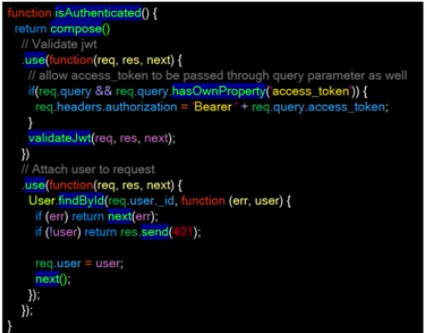

# Read: 06 - HTTP and REST

[README](/README.md)

### Review, Research, and Discussion


What’s the difference between PUT and PATCH? [RESTful API Design — PUT vs PATCH](https://medium.com/backticks-tildes/restful-api-design-put-vs-patch-4a061aa3ed0b)
- PUT -- puts the resource at the location that was specified and replaces the info that was originally there. It make an identical object with the modifications. this is a waste of bandwidth.

- Patch makes small updates and lets the server manipulate the data accordingly. 
- instead of duplicating the below with one modification but returnign the entire object again, we simply send a payload of the property that we are updating. 
- adding another window is sending just a matter of sending the payload of that one property
``` 
{
  address: 'plot 1',
  owner: 'segun',
  type: 'duplex',
  color: 'green',
  rooms: '5',
  kitchens: '1',
  windows: 20
}


{
  windows: 21
}
```
also cool is that if we are replacing something with an incorrect or non existent url, PATCH will just fail where as put would add a new thing to that url.


Provide links to 3 services or tools that allow you to “mock” an API for development like json-server 
- [Swagger](https://swagger.io/docs/)
- [PostMan](https://www.postman.com/features/mock-api/)
- [Insomnia](https://insomnia.rest/)

Compare and contrast Swagger and APIDoc.js 1 Which HTTP status codes should be sent with each type of (un)successful API call? []()

Compare and contrast SOAP and ReST [SOAP vs REST. What's the Difference?](https://smartbear.com/blog/test-and-monitor/soap-vs-rest-whats-the-difference/#:~:text=While%20SOAP%20and%20REST%20share,and%20is%20naturally%20more%20flexible.)
- SOAP (Simple Object Access Protocol) 
- REST (Representational State Transfer) -- It was made to be a simpler method of accessing web services
- SOAP is more rigid. There arerules that we have to follow of the standardization will not happen. 
- SOAP uses nasty XML which is a bugger to work with, requiring a bunch of code to make it work. 
- REST just relies of a simple url and is just json. 


### Term

SOAP
- A not so simlpe http protocol

REST Verbs
- POST, GET, PUT, PATCH, and DELETE

CRUD Verbs
- Create, READ, UPDATE/REPLACE, DELETE

Swagger
- Is a way to test out and create mock apis for server development. 


### Preview

Which 3 things had you heard about previously and now have better clarity on? [Express.js Fundamentals - 6 Middleware Explained](https://www.youtube.com/watch?v=9HOem0amlyg)
- Middleware - I understood that middleware was software in between two processes, but knowing that cors is a middleware has helped me understand what it is.
- middleware is any number of functions that are invoked by the Express.js routing layer before you final request handler is made.
  - on our route do something first, and then pass it along to the next function. 

  ```
  An example of pseudo code 

  app.get(
    // do something...
    cors.initialixe();

    // do something else...
    auth.verify(),

    // send response
    function(req,res) {
      res,render(index);
    }
  });

  ```
  A real example

  app.post('/upload'), auth.isAuthenticated(), controller. upload)
;
- this is wanting to post something the the /upload route, but first the auth method is called, if the item in authenticated, the data is sent to another middleware called controller.upload


The entire code 


Which 3 things are you hoping to learn more about in the upcoming lecture/demo?
- I really just want to learn about how to make an express server that does a bunch of things between the request and the response. 


What are you most excited about trying to implement or see how it works?
- I am excited to have more practice working with REST
