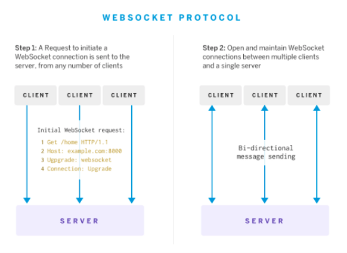

# Read 18: 10-9-2020

## Message Queues

[README](/README.md)

1. What does it mean that web sockets are bidirectional? Why is this useful?

- It means that the communications between parties will continue until disconnected. Messages will keep being passed via the same socket connection

2. Does socket.io use HTTP? Why?

- Yes, it runs on HTTP ports 80 and 443. WebSocket handshake uses the HTTP Upgrade header to switch from the HTTP protocol to the WebSocket Protocol. It allows cross browser support. It is a fallback option

3. What happens when a client emits an event?

4. What happens when a server emits an event?

- sends a message to all the connected clients
- it sends an event to anyone or only specific clients

5. What happens if a client “misses” an event?

6. How can we mitigate this?

### Terms

[Medium article on Web Sockets and bi-directional client-server communication](https://medium.com/@nerdplusdog/websocket-simultaneous-bi-directional-client-server-communication-e7948203054b)

1. Web Socket: A web socked is a type of communications protocol that allows a single TCP socket connection to be hijacked so that the client-server relationship can communicate bi-directional, full-duplex (aka double-duplex) messages instantaneously. Example: Cell phones, both parties can speak and hear the other at the same time.

2. Socket.io: Socket.IO is a library that enables real-time, bidirectional and event-based communication between the browser and the server. It consists of a Node.js server and a Javascript client library for the browser

3. Client: The 'servers' that are connected to the main hub. They communicate to the hub, but they do not know what is going on the other clients.

4. Server: The server takes in the communications and spits them out the the correct parties(clients)
