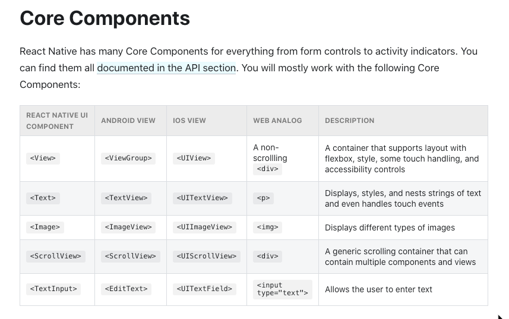

# Read 41: 12-29-2020
[Link to Directory](/README.md)
## React Native
## [Assignment Link](https://canvas.instructure.com/courses/2168372/discussion_topics/9374370)

## **Questions**
1. Compare and Contrast Redux Toolkit with Redux “Ducks”

- [Redux Toolkit](https://redux.js.org/redux-toolkit/overview)
  - This is a library that requires you to follow their patterns... It is opinionated. The reasons that it was created: 

    - "Configuring a Redux store is too complicated"
    - "I have to add a lot of packages to get Redux to do anything useful"
    - "Redux requires too much boilerplate code"

- [Redux “Ducks”](https://www.youtube.com/watch?v=fn9Y76Naw_U) is a file structure for redux
  - In this method we combine our constants, reducers, and actions all into one file called a Duck. Each new reducer is a new duck.
 Pros:
  - Faster to code since everything is in one place
  - Great for projects where you have a lot of non-complex reducers
  - Action names are unique to each project/reducer/action, so you'll never dispatch an action from the wrong reducer
  - Very simple to work with when you add 3rd party libraries
 Cons:
  - For really complex reducers, your files might be too long, and you'll have to split the reducer up
  - You might find yourself scrolling up and down the file while debugging

1. What is the principle advantage of [Redux Toolkit](https://redux.js.org/redux-toolkit/overview):
    - Redux Toolkit makes it easier to write good Redux applications and speeds up development, by baking in our recommended best practices, providing good default behaviors, catching mistakes, and allowing you to write simpler code. Redux Toolkit is beneficial to all Redux users regardless of skill level or experience. It can be added at the start of a new project, or used as part of an incremental migration in an existing project.

## **Terms**
1. [Redux toolkit slices](https://redux-toolkit.js.org/api/createSlice)
   - "A function that accepts an initial state, an object full of reducer functions, and a "slice name", and automatically generates action creators and action types that correspond to the reducers and state."

1. Namespace --- [Redux Namespace NPM](https://www.npmjs.com/package/redux-namespace) --- [Redux Namespace Github](https://github.com/evanrs/redux-namespace#readme)
  - This is what is for:
    - "Got transient state without a home? Do your components lose it when they unmount? Are you swimming in a pool of reducers that do one thing? Then Redux Namespace is for you, because all those problems are tedious and boring, and you have better things to do!

    - Redux-namespace it's a key value store, with depth."

 
 
 
 

## **Preparation Materials**
- [Getting started with react native](https://facebook.github.io/react-native/docs/getting-started)
  - Snack player : embeds and runs REact Native projects and shares how they are rendered in the assiorted platforms
  - ``view`` seems to encapsulate the ``text``
  

- [React native basics (Tutorial)](https://facebook.github.io/react-native/docs/tutorial)
- [React native](https://facebook.github.io/react-native/)
- [Expo](https://redux-toolkit.js.org/tutorials/intermediate-tutorial)
- [Expo snack](https://snack.expo.io/)
- [Ejecting](https://docs.expo.io/versions/latest/expokit/eject)