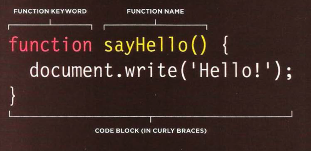

# Read: 04 - HTML Links, CSS Layout, JS Functions
4/1/20

# Chapter 4: Ch.4 “Links” (pp.74-93)
Links allow us to move from one part of the web to another, 
-Writing links
  - Use a tag elements

Linking to other pages on same site
- can use relative URL
  -the shorthand way of telling the browser where to find your files, **this is particularly useful for when building out a site because it allows you to seitch between pages easily. 
  - you can connect pages that are located in the same or different folers

Email Links
- go into an a tag with a href, mailto: and the email.
```
<a href="mailto:jon@example.org">Email Jon</a>
```
  - you can open email with the above link by adding the "to" field
### IMPORTANT
Use 'target' in order to have your link open in another tab.
//

Linking to specific parts of same page (pp. 87)
```
<a href="#top">
```
**********
**********
# Chapter 15: “Layout” (pp.358-404)

- Controlling the position of elements 
- Creating site layouts
- Designing for different sized screens

### Positioning Elements Key Concepts
- Building Blocks: Boxes are either:
  - Block level box: start on new lines
  ```
  <h1> <p> <ul> <li>
  ```
  - Inline level box: located in between surrounding text
  ```
   <b> <i>
  ```
- Containing elements pp.362
  - Boxes that sit inside of another box is a child element.
  - The outside box is the parent (containing element)

- Controlling the position of elements pp.365
  - Positioning schemes
    - Normal Flow
    - Relative Positioning
    - Absolute Positioning
    - Fixed Positioning 
    - Floating Elements

#### Can I just use flex box?

- Overlapping elements
  - These are cool! Called Z-index!
    - Puts elements infront of and behind each other

This Chapter also covers screen sizes
- pages are kept between 960-1000 px wide.
- Layout grids
  - 12 columns


//
//
//
//
# Chapter 3 (first part): “Functions, Methods, and Objects” (pp.86-99 ONLY) pdf. 93-106

Function: groups a series of statements together to do a specific task.
- calling the function : asking it to perform a task
- parameters: are the pieces of info that is passed to a function
- return values: the response/answer that you get from running the function. 

Declaring a function
- give it a name and in curly brackets, write the statements that are needed to do the task 
 pp.90

Calling a function 
- You call a function by using its name followed be ();
```
sayHello();
```

Declaring Functions that need info
- you add parameters inside of the (), the parameters are the 'variables' of the function

Calling functions that need info
- Arguments: when you call a function that has parameters, you tell the function what values to use in the parentheses. 
  -These are arguments with values pp.93

Functions can also return info to the code that called them. 
- performing a calculation returns the result.

Functions can use arrays to return more than one value. 


\\

\\

\\


