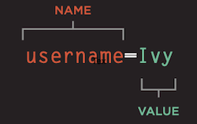

# Read: 09 - Forms and Events
- [GitHub Repo](https://github.com/Chris-Bortel/Reading-Notes)

# Chapter 7: “Forms” (p.144-175)
What this chapter is all about
- How to create a form on your website
- The different tools for collecting data
- New HTML5 form controls

### form structure
`<form>`
- action
- method
- id\
form control
- adding text
  - text input pp152
  - password input pp153
  - text area (milti-line) for things like messages and comments pp154

- making choices pp155 - 159
  - Radio buttons
  - Checkboxes
  - drop-down boxes

- submitting forms
  - submit buttons
  - image buttons
  - file upload

  ## Summary
  - if you want to collect info from cut then you need a form
  - info from a form is sent in name/value pairs
  - Each for control: given nam and the tect that user tyoes in/ selects
  HTML5 introduces new form element that make the process easier for visitors

   
  Forms work this way
  - name of each form control is sent to the server alont with the value that the user enters or selects
  - server processes the info
  - sever creates a new page to send back to the dom 
 

 
 

# Chapter 14: “Lists, Tables & Forms” (pp.330-357)
There are specific CSS properties used the controll the appearance of lists, tables, and forms
- listmarkers are manipulated using list-style-type and llist-style
- more interactive forms are better forms
- flow matters when event handlers are on an element and one of its ancetor or descendant els.
- Forms can be aligned so they are easier to use.
- you can space table sections out.

 
 

# Chapter 6: “Events” (pp.243-292)
- events are instances where the browser is letting us know that it is doing something
-events flow 
  - html el nest inside of other els, when hovering over link you will be clicking on the parent element
- we bind els which means that the el that you want an even tot happen upon
- when event happens to an element it can trigger js func. --- this is why it can feel interactive
- W3C Dom events and the most commonly used

