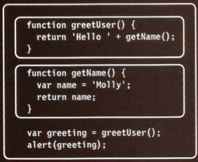
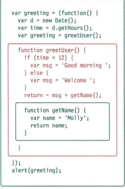
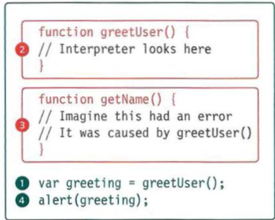
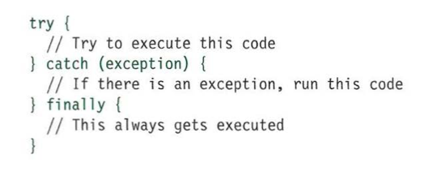

# Read: 10 - JS Debugging

 
[GitHub Repo](https://github.com/Chris-Bortel/Reading-Notes)

# This is super important. When you write JS, you are INEVITABLEY going to make mistakes and have bugs.
## Be like Sherlock 
- Deduction my dear Watson.
- We use the console to find the errors.

## The execution contexts and stacks are your friends **Use That Knowledge!**

### Stacks are cool
-New tasks in the stack are executed first.Once the task has been performed the interpereter can go back adn finish the task that was originally being processed

Knowing the execution contect and hoisting is a useful thing to look into to.
 
So is understanding the scope.
  - what happens first, where are my parents.

## use the **Try, catch, and finally statements**
The will give you an idea of what is going on.

******************************************************
- global scope -- variables declared here can be used anywhere in the code
- function-level scope -- a variable declared inside of a function can only be used inside of that function. It is in function level scope

## Please explain the stack to me!
- The JavaScript interpreter processes one line of code at a time when a statement nedds data from another function, it sttcks (orpiles) the new function on top of the current task. 

- **Stack is just** a big order of operations problem
  - CAN WE PLEASE WALK THROUGH THIS???? PG 454

### Hoisting... Execution context?
The JavaScript interpreter uses the concept of execution contexts. There is one global execution context; plus, each function creates a new new execution context. They correspond to variable scope.

### Each time a script enters a new execution context, there are two phases of activity:
#### Steps
1. Prepare
- the new scope isi created 
- variables, fucntionns, and argtuments are created 
- th evalue of the this keyword is determined
2. EXECUTE
- Now it can assign the values to variables 
- Reference functions and run their code. 
- execute statements
- ? Does this have to do with the stack?
Variable object - contains details of al of the variables, functions and parameters for that execution context

 
- this works because the function and first statement are in the same execution context.

## understanding scope... Ha
- a function is a nesting doll. children can get variables from their parents, but parent can not get the variables (genes) from their children. 

 
`
The inner bit can call on variables from above because they have already happened in the scope. functions from above cannot call the lower parts, becasue they have not happened yet. pp 457
`

## understanding Errors... Alright, I believe...
- If a JavaScript statement generates an error, then it throws an exception . At that point, the interpreter stops and looks for exception-handling code
  - you can handle errors by using a bunch of statements designed to do just that. 

 
'
I think that I get it. The function 2 is and error because the variables are out of scope, so the 3rd is also an error.
- Having no exception handler causes the code to fail.
'
So many type of errors
'
- SyntaxErrors
- ReferenceErrors
- EvalErrors
- URIError
- INCORRECT USE OF URI FUNCTIONS
If these characters are not escaped in URls, they will cause an error: / ? & I : ;
CHARACTERS ARE NOT ESCAPED decodeURI('http://bbc.com/ news.phplla=l') ;
URlError: URI error
'

- TypeError -- value is unexpected data type
  - cause when trying to use an object or method that does not exist.

### fixing errors. 
Debugging is an option, but there are more "graceful" ways to deal with it. Enter the writing of error-handling code. 
#### Checkout Handling exceptions pp. 480

 

