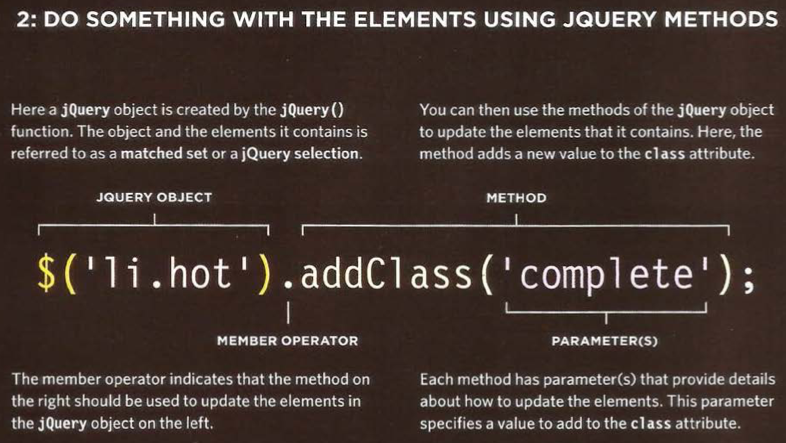
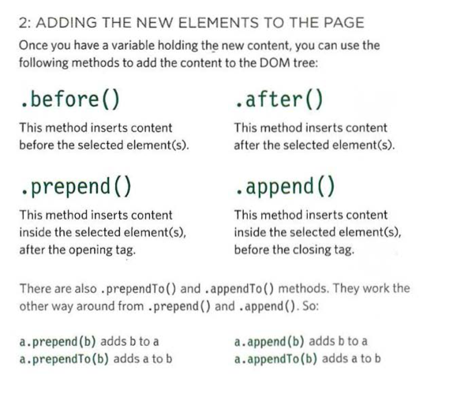
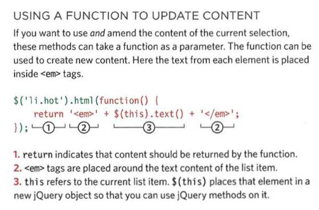

# Read: 02 - jQuery, Events, and The DOM | Pair Programming

[README](/README.md)


## JavaScript and jQuery book by Jon Duckett 

## 293-301 
jQuery is a js file that lets you find els using CSS-style selectors and then do something with the elements usiing jQuery methods
- call jQuery using $
- similar to dom queries but with simpler syntax
- can store the jQuery object in a variable, just as you can with DOM nodes

How to use it. 
- put the script tag in. 



```
$(' :header').addClass('headline'); 
$('li:lt(3)').hide().fadeln(lSOO);
$('li').on('click', function() { 
    $(this) . remove();
}) ;
```
- first line selects all header elements
- second line selects the first three li
  - hides el and then fades them into view
  - last three lines set an event listener to trigger a function that remioves the el from the page


but why use it?
- it makes coding simpler
  - Loop through elements
  0 add. remive elements from the DOM tree
  - handle events 
  - fade elements into / out of view
  - Handle Ajax requests

## 306-331 
Matched set / jQuery selection
# When you select one or more elements, a jQuery object is returned
- This is known as a matched set or a jquery selection.


.each() selects content of all of the elements

### caching jQuery selections in variables
- a jQuery object stores a reference to it in a variable
- to re use the same jQuery object agin , you store a reference to the jQuery object in a variable. 

```
$('li');

store it like this

$listItems = $('li');
```

## Looping
- no need to write loops: when a selector returns multiple elements we can update all of them using the one method. 


Implicit interation: The ability to update all of the elements in the jQuery selection. 
- use the .each() methough to get info from a series of elements

## Chaining
- The process of placing several methods in the same selector. This makes the code more compact
```
$( 'l i [id!="one"] ') .hide() .delay(SOO) .fadeln(1400);

// it looks nicer like this 
$('li[id!="one"] ') .hide()
.delay(500)
. fadeln(1400);

```
methods that retrieve information from the DOM (or about the browser) cannot be chained.
- *if one method in the chain does not work, the rest will not run either*

.ready() method checks that the page is ready for your code to work with 
### getiing the element content
.html() and .text


creating new elements in a jquery object 
- $newFragment:  creates a variable called $newFragment
The jQuery object is set to contain an empty 
```
<li>element:var $newFragment = $('<li>'};
```
adding the new elements to the page


### changing content



## getting and setting css properties
.css() method lets us retrieve and set the values of CSS properties


pg.322
- To get the value of a CSS property, you indicate which property you want to retrieve in parentheses. If the matched set contains more than one element, it will return the value from the first element.
- To set the values of a CSS property, you specify the property name as the first argument in the parentheses, then a comma, followed by its value as the second argument. This w ill update every element
in the matched set. You can also specifymultiplepropertiesinthe same method using object literal notation.


## WORKING WITH EACH ELEMENT IN A SELECTION

.each() method allows us to recreate the functionality of a loop on a selection of elements.


- shows how to use the .each() method


# 6 Reasons to pair program
[Article](https://www.codefellows.org/blog/6-reasons-for-pair-programming/)

### Why pair program?
- four fundamental skills that help anyone learn a new language: Listening: hearing and interpreting the vocabulary Speaking: using the correct words to communicate an idea Reading: understanding what written language intends to convey Writing: producing from scratch a meaningful.
- lets us speak about code, listen to others guidance, read code that others have writen, and write the code ourselves.


