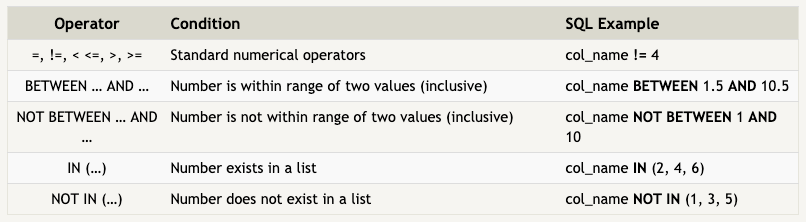
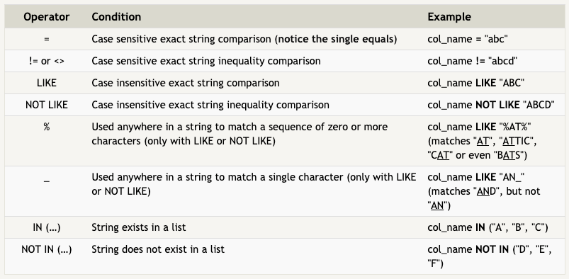

# Read-08 SQL
[README](/Readme.md)

## [SQL Bolt Tutorial](http://sqlbolt.com/)

SQL: Structured Query Language
- A language that allows technical and non tech users to query, manipulatem and transform data from a relational database. 
- It is safe and scalable.

Relational databases
- a collection of related 2D tables. Each table has a fixed number of named columns (the attributes or properties of teh table) and any number of rows of data

SELECT queries
- we retrieve data from the sql db using SELECT statements(queries)
  - declares what data we are looking for, where to find iti, and optionally, how to transform it. 
- each row in the table is a specific instance of a type(cairn terrior, lab, etc)
- columns represent the common properties shared by all instances of that entity

Select queries for specific columns


```
SELECT column, another_column, ...
FROM mytable
```


Select query for all columns
```
SELECT *
FROM mytable;
```


More Specific Queries (Queries with constraints)





... Even more constraints





We use these as follows


```
SELECT column, another_column, ...
FROM mytable
WHERE condition
    AND/OR another_condition
    AND/OR ...;
```


### My take away
There is a whole bunch that we can do using SQL. So much so that I need to bookmark the documentation and the cheatsheets. There is no way that I am going to remember all of this stuff. 