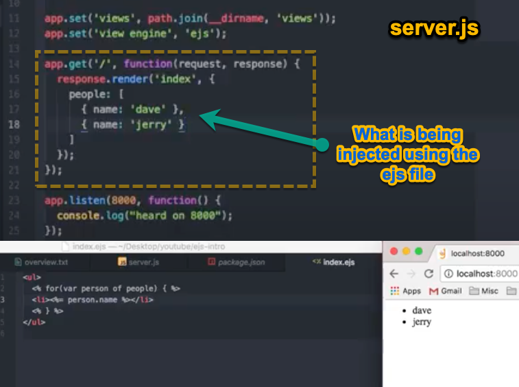

# Read: 11 - EJS

## [Watch EJS tutorial from WalkThroughCode on YouTube, Videos 1-5](https://www.youtube.com/watch?v=IqpfBGsALqc&list=PL7sCSgsRZ-slYARh3YJIqPGZqtGVqZRGt)

### Getting started  || *could use db config* ||
Install cors express ejs partials body-parser

I am going to need a views file
need an index.ejs file


Inject variable into ejs view and then how to evaluate that variable


the .render() method takes 3 parameters
view, object of local variable and the callback

the injector pushed new values into elements
- use case is to easily delete things


## If/Else statements

### This is what I think is going on
- ejs is a was for us to inject html text directly into the browser


## Layouts (layout file is our wrapper)
- not native to ejs but super useful
  - npm i express-ejs-layouts

    - ????? do I need the use npm i --save express-ejs-layouts ?????

  - need to require expressLayouts 
```
    var expressLayouts = require('express-ejs-layouts');

    also need

    app.use(expressLayouts);
```
Lets us use the body as a place hold for teh views that go into the layout

## Partials
- easy way to use re-usable text

Code Snippets and notes




